# 数据类型

 

 

 

注意： **布尔类型开头是大写**

 

## 查看数据类型

 

输出： 

 

 

## 整数的表达方式

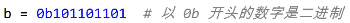 

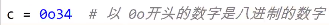 

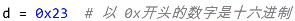 

**进制转换：**bin(); oct(); hex();

## 类型转换

### 整数转换

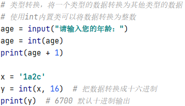 

### 浮点数转换

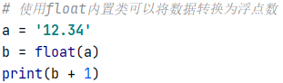 

### 字符串转换

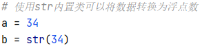 

### 布尔值转换

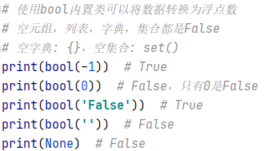 

# 标识符和关键字


print函数解释： 

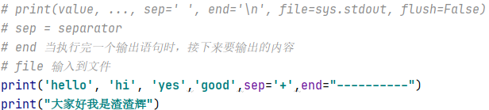

# 输入语句的使用

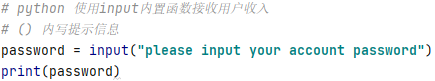 

# 运算符

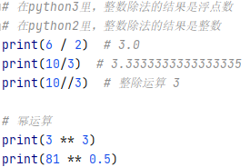 

**注意：**整除是 ***向下***  取整

## 字符串运算符

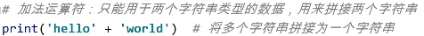 

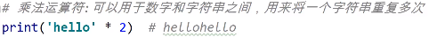 

## 赋值运算符

可以传递赋值

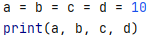 

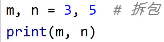 拆包时，变量与值 ***个数*** 要一一对应

```python
o, *p, q = 1, 2, 3, 4, 5, 6  # *p 代表可变长度
print(o, p, q)  # 1 [2, 3, 4, 5] 6
```

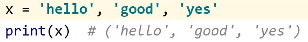 x 是 ***元组*** 类型，小括号省略

```python
# 比较运算符在字符串里的使用
# 根据各个字符的编码值逐位比较
print('a' > 'b')  # False
print('abd' > 'b')  # False
```

## (*)逻辑运算符

```python
# 逻辑运算符：not and or(优先级从高到低)
print((3 > 2 and 5 > 4))  # True
print((3 > 2 or 5 > 3))  # True
print(not 3 > 2)  # false
```

```python
# 逻辑与运算做取值时，取第一个为 False 的值；
# 如果所有运算数都是 True，取最后一个值
a = 3 and 5 and 0 and 'hello'  # 0
b = 'good' and 'yes' and 'ok' and 100  # 100
```

```python
# 逻辑或运算做取值时，取第一个为 True 的值；
# 如果所有运算数都是False，取最后一个值
a = 0 or 0 or 3 or 'hello'  # 3
b = 0 or [] or {} or ()  # ()
```

```python
# 位运算符
# &(与) |(或) ^(异或) <<(左移) >>(右移) ~(取反)
```

# 分支语句

## 条件语句

```python
# python 里的条件判断语句：if/ if else/ if elif elif else
# python 里不支持 switch case 语句
if age < 18:
    print('未满十八岁，禁止入内')
else:
    print("请进")
    
# ----------------------------    

if score >= 90:
    print("优秀")
elif score >= 80:
    print("良好")
elif score >= 60:
    print("及格")
else:
    print("不及格")
    
# ----------------------------       

# 三元表达式 if ... else 的简写
num1 = int(input())
num2 = int(input())

x = num1 if num1>num2 else num2 # x取大的值
```

## pass关键字

```python
#python语言结构通过缩进表示
age = int(input("请输入你的年龄："))
if age > 18:
    pass  # 使用pass占位，保证程序不报错    
print("欢迎访问网站")
```

## random函数

```python
# 随机出一个数字, [0,2]
# 使用随机数函数 random
# random.randint(a,b), 能够生成[a,b]的随机整数
computer = random.randint(0, 2)
```

## 循环语句

注意:  python ***<span style = 'color:red'>不支持</span>*** do...while 循环

### while循环

```python
x = 0
while x < 10:
    print("hello")
    x += 1
    # x++ python里面没有自增自减
```

### for...in循环

```python
# for ele in iterableItem
# range(a,b) [a,b) 内置类指定区间整数序列
# 可迭代对象: 字符串 列表 元组 字典 集合 range
for i in range(1,10):
    print(i)
for i in 'hello':
    print(i)
```

### break关键字

### continue关键字

### for...else

```python
# 打印200以内质数
for i in range(2, 201):
    tmp = int(i ** 0.5)
    for j in range(2, tmp + 1):
        if i % j == 0:
            break
    else:  # for...else 当循环break没有执行的时候,执行else
        print(i, '是质数')
```

# 字符串

## 字符串的表示

```python
# python里可以用以下方式表示字符串
'hello'  # 一对单引号
"hello"  # 一对双引号
'''hello'''  # 一对三个单引号
"""hello"""  # 一对三个双引号

# 在python里, 字符串前面加 r 表示原生字符串
x = r'hello \teacher'
```

## 下标和切片

```python
# 下标又叫索引, 表示第几个数据
# 可迭代对象: str list tuple dict set range 可以遍历
# str list tuple 可以使用下标获取或操作数据
word = 'zhangsan'
print(word[4])
# 字符串是不可变数据类型
# word[4] = 'x' 报错

# 切片: 从字符串里复制一段指定内容, 生成一个新的字符串
m = 'abcdefghijklmn'
# str(start:end:step), [start end)左闭右开
print(m[2:9])  # cdefghi
print(m[2:])  # cdefghijklmn, 只设置start会直到最后
print(m[:9])  # abcdefghi, 只设置end会从头开始
print(m[2:9:2])  # cegi, step指步长, step不能为0
print(m[9:2:-1])  # jihgfed, step为负数, 从右往左找
print(m[-9:-2])  # fghijkl, 从右往左为负数 -9:f, -2:m
print(m[:])  # abcdefghijklmn, 从头到尾
print(m[::])  # abcdefghijklmn, 从头到尾
print(m[::-1])  # nmlkjihgfedcba, 从尾到头
```

## 字符串常见操作

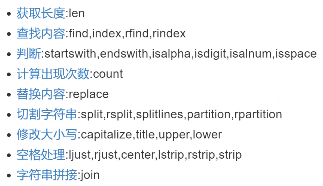 

### 查找

```python
x = 'abcdefghijklmna'

# 使用内置函数获取长度
print(len(x))

# 查找内容的相关方法, find/index/rfind/rindex
print(x.find('l'))  # 11 获取指定字符下标
print(x.index('l'))  # 11 获取指定字符下标
print(x.find('z'))  # 如果字符不存在, 返回-1
# print(x.index('z'))  # 如果字符不存在, 报错

print(x.find('j', 4, 10))  # 9 [start,end)
print(x.rfind('a'))  # 14 找最大的下标
```

### 判断

注: 结果是bool类型

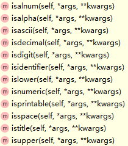 

```python
# startswith, endswith
print('hello'.startswith('he'))  # True
print('hello'.endswith('lo'))  # True

print('123'.isdigit())  # True
print('3.14'.isdigit())  # False
```

### 替换

```python
# replace方法: 替换字符串
word = 'hello'
m = word.replace('l', 'x')
print(word)  # hello
print(m)  # hexxo
```

### 分割

```python
# split rsplit splitlines partition rpartition
# split可以将一个str分割成list
x = '1,2,3,4,5,6,7'
x1 = x.split(',')
print(x1)  # ['1', '2', '3', '4', '5', '6', '7']

x2 = x.rsplit(',')
print(x2)  # ['1', '2', '3', '4', '5', '6', '7']
print(x.split(',', 2))  # ['1', '2', '3,4,5,6,7']
print(x.rsplit(',', 2))  # ['1,2,3,4,5', '6', '7']

# partition 指定一个字符串作为分隔符,分为三部分, 左边第一个
m = 'abcdefghijklmn'
print(m.partition('fgh'))  # ('abcde', 'fgh', 'ijklmn')元组类型

# rpartition 指定一个字符串作为分隔符,分为三部分, 右边第一个
m = '2020.2.14不要打开.MP4'
print(m.rpartition('.'))  # ('2020.2.14不要打开', '.', 'MP4')
```