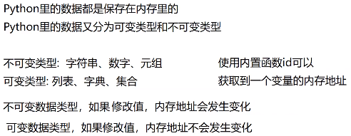

# 数据类型

 

 

 

注意： **布尔类型开头是大写**

 

## 查看数据类型

 

输出： 

 

 

## 整数的表达方式

 

 

 

**进制转换：**bin(); oct(); hex();

## 类型转换

### 整数转换

 

### 浮点数转换

 

### 字符串转换

 

### 布尔值转换

 

# 标识符和关键字

 

print函数解释： 

 

# 输入语句的使用

 

# 运算符

 

**注意：**整除是 ***向下***  取整

## 字符串运算符

 

 

## 赋值运算符

可以传递赋值

 

 拆包时，变量与值 ***个数*** 要一一对应

```python
o, *p, q = 1, 2, 3, 4, 5, 6  # *p 代表可变长度
print(o, p, q)  # 1 [2, 3, 4, 5] 6
```

 x 是 ***元组*** 类型，小括号省略

```python
# 比较运算符在字符串里的使用
# 根据各个字符的编码值逐位比较
print('a' > 'b')  # False
print('abd' > 'b')  # False
```

## (*)逻辑运算符

```python
# 逻辑运算符：not and or(优先级从高到低)
print((3 > 2 and 5 > 4))  # True
print((3 > 2 or 5 > 3))  # True
print(not 3 > 2)  # false
```

```python
# 逻辑与运算做取值时，取第一个为 False 的值；
# 如果所有运算数都是 True，取最后一个值
a = 3 and 5 and 0 and 'hello'  # 0
b = 'good' and 'yes' and 'ok' and 100  # 100
```

```python
# 逻辑或运算做取值时，取第一个为 True 的值；
# 如果所有运算数都是False，取最后一个值
a = 0 or 0 or 3 or 'hello'  # 3
b = 0 or [] or {} or ()  # ()
```

```python
# 位运算符
# &(与) |(或) ^(异或) <<(左移) >>(右移) ~(取反)
```

## 交换两个变量值

```python
# 只能是数字
a = 10
b = 13
a = a + b
b = a - b
a = a - b
print(a)  # 13
print(b)  # 10

# 异或
a = a ^ b
b = a ^ b
a = a ^ b
print(a)  # 13
print(b)  # 10

# python特有
a, b = b, a
print(a)  # 13
print(b)  # 10
```

# 分支语句

## 条件语句

```python
# python 里的条件判断语句：if/ if else/ if elif elif else
# python 里不支持 switch case 语句
if age < 18:
    print('未满十八岁，禁止入内')
else:
    print("请进")
    
# ----------------------------    

if score >= 90:
    print("优秀")
elif score >= 80:
    print("良好")
elif score >= 60:
    print("及格")
else:
    print("不及格")
    
# ----------------------------       

# 三元表达式 if ... else 的简写
num1 = int(input())
num2 = int(input())

x = num1 if num1>num2 else num2 # x取大的值
```

## pass关键字

```python
#python语言结构通过缩进表示
age = int(input("请输入你的年龄："))
if age > 18:
    pass  # 使用pass占位，保证程序不报错    
print("欢迎访问网站")
```

## random函数

```python
# 随机出一个数字, [0,2]
# 使用随机数函数 random
# random.randint(a,b), 能够生成[a,b]的随机整数
computer = random.randint(0, 2)
```

## 循环语句

注意:  python ***<span style = 'color:red'>不支持</span>*** do...while 循环

### while循环

```python
x = 0
while x < 10:
    print("hello")
    x += 1
    # x++ python里面没有自增自减
```

### for...in循环

```python
# for ele in iterableItem
# range(a,b) [a,b) 内置类指定区间整数序列
# 可迭代对象: 字符串 列表 元组 字典 集合 range
for i in range(1,10):
    print(i)
for i in 'hello':
    print(i)
```

### break关键字

### continue关键字

### for...else

```python
# 打印200以内质数
for i in range(2, 201):
    tmp = int(i ** 0.5)
    for j in range(2, tmp + 1):
        if i % j == 0:
            break
    else:  # for...else 当循环break没有执行的时候,执行else
        print(i, '是质数')
```

# 字符串

## 字符串的表示

```python
# python里可以用以下方式表示字符串
'hello'  # 一对单引号
"hello"  # 一对双引号
'''hello'''  # 一对三个单引号
"""hello"""  # 一对三个双引号

# 在python里, 字符串前面加 r 表示原生字符串
x = r'hello \teacher'
```

## 下标和切片

```python
# 下标又叫索引, 表示第几个数据
# 可迭代对象: str list tuple dict set range 可以遍历
# str list tuple 可以使用下标获取或操作数据
word = 'zhangsan'
print(word[4])
# 字符串是不可变数据类型
# word[4] = 'x' 报错

# 切片: 从字符串里复制一段指定内容, 生成一个新的字符串
m = 'abcdefghijklmn'
# str(start:end:step), [start end)左闭右开
print(m[2:9])  # cdefghi
print(m[2:])  # cdefghijklmn, 只设置start会直到最后
print(m[:9])  # abcdefghi, 只设置end会从头开始
print(m[2:9:2])  # cegi, step指步长, step不能为0
print(m[9:2:-1])  # jihgfed, step为负数, 从右往左找
print(m[-9:-2])  # fghijkl, 从右往左为负数 -9:f, -2:m
print(m[:])  # abcdefghijklmn, 从头到尾
print(m[::])  # abcdefghijklmn, 从头到尾
print(m[::-1])  # nmlkjihgfedcba, 从尾到头
```

## 字符串常见操作

 

### 查找

```python
x = 'abcdefghijklmna'

# 使用内置函数获取长度
print(len(x))

# 查找内容的相关方法, find/index/rfind/rindex
print(x.find('l'))  # 11 获取指定字符下标
print(x.index('l'))  # 11 获取指定字符下标
print(x.find('z'))  # 如果字符不存在, 返回-1
# print(x.index('z'))  # 如果字符不存在, 报错

print(x.find('j', 4, 10))  # 9 [start,end)
print(x.rfind('a'))  # 14 找最大的下标
```

### 判断

注: 结果是bool类型

 

```python
# startswith, endswith
print('hello'.startswith('he'))  # True
print('hello'.endswith('lo'))  # True

print('123'.isdigit())  # True
print('3.14'.isdigit())  # False
```

### 替换

```python
# replace方法: 替换字符串
word = 'hello'
m = word.replace('l', 'x')
print(word)  # hello
print(m)  # hexxo
```

### 分割

```python
# split rsplit splitlines partition rpartition
# split可以将一个str分割成list
x = '1,2,3,4,5,6,7'
x1 = x.split(',')
print(x1)  # ['1', '2', '3', '4', '5', '6', '7']

x2 = x.rsplit(',')
print(x2)  # ['1', '2', '3', '4', '5', '6', '7']
print(x.split(',', 2))  # ['1', '2', '3,4,5,6,7']
print(x.rsplit(',', 2))  # ['1,2,3,4,5', '6', '7']

# partition 指定一个字符串作为分隔符,分为三部分, 左边第一个
m = 'abcdefghijklmn'
print(m.partition('fgh'))  # ('abcde', 'fgh', 'ijklmn')元组类型

# rpartition 指定一个字符串作为分隔符,分为三部分, 右边第一个
m = '2020.2.14不要打开.MP4'
print(m.rpartition('.'))  # ('2020.2.14不要打开', '.', 'MP4')
```

### 大小写

```python
print('hello world'.capitalize())  # 首字母大写
print('hello'.upper())  # HELLO
print('HELLO'.lower())  # hello
print('hello world'.title())  # Hello World
```

### 空格处理

```python
# Ljust 字符串以指定长度显示, 默认在右边用空格补齐
# Ljust(width, fillchar)
print('Monday'.ljust(10, '*'))  # Monday****
print('Monday'.rjust(10, '*'))  # ****Monday
print('Monday'.center(10, '+'))  # ++Monday++

print('    apple    '.lstrip())  # 去掉左边空格
print('    apple    '.rstrip())  # 去掉右边空格
print('    apple    '.strip())  # 去掉两边空格
print('++++apple++++'.strip('+'))  # 去掉两边'+'

# 将字符串分割成列表
x = 'zhangsan,lisi,wangwu'
print(x.split(','))#['zhangsan', 'lisi', 'wangwu']
# 将列表转为字符串
fruits = ['apple', 'pear', 'peach', 'orange']
print('-'.join(fruits))  # apple-pear-peach-orange
```

## 字符集

```python
# 使用内置函数 chr 和 ord, unicode字符编码
print(ord('a'))  # 97
print(chr(26666))  # 株

# 转化为指定字符集的结果
# gbk 一个汉字两个字节 utf8一个汉字3个字节
print('你'.encode('gbk'))  # b'\xc4\xe3' 0xc4e3
print('你'.encode('utf8'))  # b'\xe4\xbd\xa0' 0e4bda0
print(b'\xe4\xbd\xa0'.decode('utf8'))  # 你
```

## 成员运算符

```python
# in 和 not in 运算符
# 用来判断一个内容在可迭代对象里是否存在

word = 'hello'
list = ['hello', 'world', 'love', 'you']
print('e' in word)  # True
print('hello' in list)  # True
print('assassin' not in list)  # True
```

## 格式化打印

```python
# 可以使用 % 占位符表示格式化字符串
name = 'Andrew'
age = 18
print('hello, I am ', name, ', ', age, ' years old', sep='')

# %s ==> 字符串占位符
# %d ==> 整数占位符
# %f ==> 浮点数占位符
print('hello, I am %s, %d years old, I earn $%f ' % (name, age, 3.14))

# %nd ==> 整数占位符
print('大家好, 我是%3d号男嘉宾' % 15)   #  15
print('大家好, 我是%03d号男嘉宾' % 15)  # 005
print('大家好, 我是%-3d号男嘉宾' % 15)  # 5

# %.nf ==> 小数点后n位
print('我今天挣了%.2f元钱' % 16.666666)  # 我今天挣了16.67元钱

# %x, %X
print(255) # 255
print('%x' % 255)  # ff
print('%X' % 255)  # FF

# %%
print('%%s %%d %d' % 16)  # %s %d 16
```

## format方法

```python
# {} 进行占位
x = 'hello I am {}, {} years old'.format('Andrew', 23)
print(x)  # hello I am Andrew, 23 years old

# {下标}
y = 'hello I am {1}, {0} years old'.format(20, 'Jerry')
print(y)

# {变量名}
z = 'hello I am {name}, {age} years old, come from {addr}'.format(age=20, name='Jerry', addr='Beijing')
print(z)

m = ['zhangsan', 18, 'shanghai']
n = 'hello I am {}, {} years old, come from {}'.format(m[0], m[1], m[2])
print(n)  # hello I am zhangsan, 18 years old, come from shanghai
n = 'hello I am {}, {} years old, come from {}'.format(*m)
print(n)  # hello I am zhangsan, 18 years old, come from shanghai

q = {'name': 'zhangsan', 'age': 18, 'addr': 'shanghai'}
p = 'hello I am {name}, {age} years old, come from {addr}'.format(**q)
print(p)  # hello I am zhangsan, 18 years old, come from shanghai
```

# 列表

## 列表的基本使用

```python
# 当有多个数据需要 按照一定顺序 保存的时候, 可以考虑列表

# 使用 [] 表示一个列表, 每一个数据称为元素, 用逗号分隔
namesList = ['关羽', '张飞', '刘备', '诸葛亮', '小乔', '大乔']

# 可以下标访问, 切片
print(namesList[2])
namesList[2] = '貂蝉'
print(namesList[2:5])

# list(可迭代对象)
names = ('关羽', '张飞', '刘备', '诸葛亮')
print(list(names))  # ['关羽', '张飞', '刘备', '诸葛亮']
```

## 列表的插入

```python
# 操作列表, 一般包括 增删改查

heroes = ['镜', '嬴政', '露娜', '娜可露露']

# 添加元素的方法
# append
heroes.append('黄忠')
print(heroes)  # 在列表最后面追加

# insert(index, object) 在指定位置插入
heroes.insert(1, '小乔')
print(heroes)

# extend(iterable) 添加可迭代对象
newHeroes = ['狄仁杰', '王昭君']
heroes.extend(newHeroes)
print(heroes)
```

## 列表的删除

```python
# 删除元素 pop
print(heroes)  # ['镜', '小乔', '嬴政', '露娜', '娜可露露', '黄忠', '狄仁杰', '王昭君']
x = heroes.pop()  # 删除并返回
print(x)  # 王昭君
x = heroes.pop(2)  # 删除指定下标的元素
print(x)  # 嬴政
print(heroes)  # ['镜', '小乔', '露娜', '娜可露露', '黄忠', '狄仁杰']

# remove
heroes.remove('小乔')  # 删除不存在的会报错
print(heroes)  # ['镜', '露娜', '娜可露露', '黄忠', '狄仁杰']

# del关键字 这个功能强大, 列表删除少用
del heroes[2]
print(heroes)  # ['镜', '露娜', '黄忠', '狄仁杰']

# clear
heroes.clear()
print(heroes)  # []
```

## 列表的查询

```python
# 查询
heroes = ['镜', '小乔', '镜', '露娜', '娜可露露', '黄忠', '狄仁杰']
print(heroes.index('镜'))  # 返回下标, 不存在元素报错
print(heroes.count('镜'))  # 2, 返回个数

# in 运算符
flag = '小乔' in heroes
print(flag)  # True
```

## 列表的修改

```python
# 修改元素, 使用下标直接修改
heroes[1] = '镜'
print(heroes)  # ['镜', '镜', '镜', '露娜', '娜可露露', '黄忠', '狄仁杰']
```

## 列表的遍历

```python
# while 循环, for in循环
heroes = ['镜', '小乔', '露娜', '娜可露露', '黄忠', '狄仁杰']

for hero in heroes:
    print(hero, end=' ')

i = 0
while i < len(heroes):
    print(heroes[i], end=' ')
    i += 1
```

## 列表的排序和反转

```python
# sort()直接对列表排序
nums = [6, 5, 3, 1, 8, 7, 2, 4]
nums.sort()
print(nums)  # [1, 2, 3, 4, 5, 6, 7, 8]
nums.sort(reverse=True)
print(nums)  # [8, 7, 6, 5, 4, 3, 2, 1]

# sorted()内置函数, 返回新的列表, 不改变原来的列表
print(sorted(nums))  # [1, 2, 3, 4, 5, 6, 7, 8]

# reverse()
nums = [6, 5, 3, 1, 8, 7, 2, 4]
nums.reverse()
print(nums)  # [4, 2, 7, 8, 1, 3, 5, 6]
```

## (*)列表的复制

  